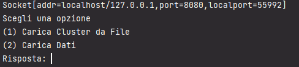

# Progetto Kmeans (2023/2024) <!-- omit in toc -->

## Indice <!-- omit in toc -->
- [Team progetto](#team-progetto)
- [Descrizione Kmeans](#descrizione-kmeans)
- [Progetto base](#progetto-base)
- [Progetto esteso](#progetto-esteso)
- [Guida di installazione](#guida-di-installazione)
  - [Installazione Server](#installazione-server)
  - [Installazione Client (CLI e GUI)](#installazione-client-cli-e-gui)
- [Guida utente](#guida-utente)
  - [Avvio del Server (progetto base)](#avvio-del-server-progetto-base)
  - [Avvio del Client (progetto base)](#avvio-del-client-progetto-base)
  - [Avvio del Server (progetto esteso)](#avvio-del-server-progetto-esteso)
  - [Avvio del Client (progetto esteso)](#avvio-del-client-progetto-esteso)
- [Guida di utilizzo](#guida-di-utilizzo)
  - [Utilizzo del Client (progetto base)](#utilizzo-del-client-progetto-base)
  - [Utilizzo del Client (progetto esteso)](#utilizzo-del-client-progetto-esteso)
    - [Schermata Credenziali Server](#schermata-credenziali-server)
    - [Schermata Menu](#schermata-menu)
    - [Schermata risultato lettura cluster da file](#schermata-risultato-lettura-cluster-da-file)
    - [Schermata risultato scoperta cluster](#schermata-risultato-scoperta-cluster)
- [Casi di Test](#casi-di-test)

## Team progetto
---
| Nome | Cognome | Username GitHub |
| -- | -- | -- |
| Leonardo | Colucci | [xDrokra](https://github.com/xDrokra) |
| Gianfranco | De Vincenzo| [GianfrancoDev18](https://github.com/GianfrancoDev18) |

## Descrizione Kmeans
---
Il K-means è un algoritmo di **clustering**, una tecnica di apprendimento non supervisionato utilizzata per suddividere un insieme di dati in gruppi omogenei chiamati cluster. L'obiettivo del K-means è di assegnare ogni punto dati al **cluster più vicino**, in modo che i punti all'interno di ciascun cluster siano simili tra loro e i punti tra cluster diversi siano diversi. Ecco come funziona l'algoritmo K-means:
- **Inizializzazione**: Si inizia scegliendo il numero desiderato di cluster, chiamato K, e si selezionano casualmente K punti come centroidi iniziali. Un centroide rappresenta il centro del cluster.
- **Assegnazione**: Per ogni punto dati, viene calcolata la distanza tra il punto e i centroidi. Il punto viene assegnato al cluster rappresentato dal centroide più vicino in base alla distanza.
- **Aggiornamento dei centroidi**: Una volta assegnati tutti i punti ai cluster, i centroidi vengono aggiornati calcolando la media delle posizioni dei punti all'interno di ciascun cluster. Questa media diventa il nuovo centroide per il cluster corrispondente.
- **Ripetizione**: I passi 2 e 3 vengono ripetuti fino a quando i centroidi smettono di cambiare o si raggiunge un numero massimo di iterazioni. In generale, l'algoritmo converge verso una soluzione stabile, anche se la soluzione ottenuta può essere un minimo locale invece del minimo globale.
- **Risultato**: Alla fine delle iterazioni, si ottiene un insieme di K centroidi e i punti dati assegnati a ciascun cluster. Questi cluster possono essere utilizzati per analizzare i dati, identificare pattern o raggruppare elementi simili insieme

## Progetto base
---
La versione base del progetto consiste in un'architettura *client/server* che permette all'utente la scoperta/lettura di cluster tramite le varie opzioni offerte nel menu'.
Il **server** dovra' essere eseguito su una macchina con un database **MySQL** in esecuzione.

Il servizio sara' raggiungibile sulla porta *8080*, e potra' comunicare con diversi client contemporaneamente. 
I servizi offerti dal server (*offerti all'utente tramite il client CLI*) sono i seguenti:
- lettura di cluster fornendo al server il path del file in cui sono serializzati i cluster da recuperare
- scoperta di cluster fornendo al server il nome della tabella presente nel database ed il numero di cluster da scoprire
- salvare i centroidi generati dalla scoperta nella macchina dove il server viene eseguito, dove potranno essere successivamente letti.

Il server effettuerà dei log su console di quanto accade durante la sua esecuzione (ad esempio, connessione di un client o errore durante la creazione di un albero di regressione).
I messaggi di errore rilevanti per l’utente verranno inviati al client.
Il client da riga di comando permette di collegarsi ad una macchina che sta eseguendo un'istanza del server, l'indirizzo IP e la porta sono settati di default. L'utente nel menu' avra le due opzioni di lettura o scoperta di cluster

## Progetto esteso
---
L'estensione per il progetto consiste in un'interfaccia grafica per desktop. Tale interfaccia e' stata sviluppata tramite il framework **Swing**

## Guida di installazione
---
I file `.jar`, `.bat` e dove necessario `.sql` sono posti nella cartella **out\artifacts\esegubili** di *ogni progetto*. 

Mentre i **JavaDocs** si trovano all'interno della cartella **out\artifacts\javadocs**

### Installazione Server
---
Per *eseguire correttamente* il server sulla propria macchina e' necessario:
- aver installato la *Java Runtime Environment 8 o superiore*
- aver installato *MySQL*
- eseguire il file `script.sql` per creare l'utente MySQL, il *Database* e la *tabella* necessaria

### Installazione Client (CLI e GUI)
---
Per *eseguire correttamente* il client (sia testuale che grafico) e' necessario:
- aver installato la *Java Runtime Environment 8 o superiore*
- avere un *server in ascolto*
**NB:** Il server in ascolto deve essere lo stesso presentato con il client utilizzato, in quanto non e' possibile, ad esempio, utilizzare il server presentato nel progetto base con il client grafico. Inoltre, anche i file coi cluster memorizzati da caricare devono essere stati creati dalla stessa versione del server che deve utilizzarli.

## Guida utente
### Avvio del Server (progetto base)
---
Per avviare il server e' necessario eseguire il file `server.bat` nella stessa cartella di `server.jar`. In alternativa e' possibile avviarlo da riga di comando tramite il comando `java -jar server.jar`

### Avvio del Client (progetto base)
---
Per avviare il Client da riga di comando, è necessario eseguire il file `client.bat` nella stessa cartella del file `client.jar`. Questa modalità di avvio connetterà il Client ad un server in esecuzione sulla propria macchina, sulla porta 8080. Per specificare un altro server a cui connettersi, è necessario avviare il Client da una shell tramite il comando `java -jar client.jar [INDIRIZZO_IP] [PORTA]` o inserendo tale comando nel file batch di avvio.

### Avvio del Server (progetto esteso)
---
Simile al progetto base, il server del progetto esteso e' eseguibile avviando il file `server.bat` nella stessa cartella di `server.jar`. In alternativa e' possibile avviarlo da riga di comando tramite il comando `java -jar server.jar`. La porta di default sara' *8080*

### Avvio del Client (progetto esteso)
---
Per avviare il client grafico è necessario avviare il file `clientWithArgs.bat` nella stessa cartella di `client.jar`. Questa modalità di avvio connetterà il Client ad un server in esecuzione sulla propria macchina, sulla porta 8080. Per specificare un altro server a cui connettersi, è necessario avviare l'altro file `clientWithoutArgs.bat` che chiedera' direttamente al client di inserire la porta e l'indirizzo ip del server.

## Guida di utilizzo
### Utilizzo del Client (progetto base)
---
Una volta avviato il Client, se la connessione con il server va a buon fine si specifica quale operazione si vuole effettuare. 

- Se scelta l'opzione **1** verra' richiesto il path del file, banalmente il nome del path sara' il nome della tabella all'interno del db, piu' il **k** che indica il numero di centroidi. Successivamente si puo' ritornare al menu per effettuare altre operazioni.

- Se scelta l'opzione **2** verra' richiesto il nome della tabella da trovare nel db e il numero di cluster in modo tale per effettuare l'algoritmo del Kmeans. Successivamente se tutto va buon fine i centroidi generati verranno salvati automaticamente.

- Una volta finita l'operazione verra' richiesto all'utente di ripetere l'opzione **2** con un possibile numero differente di cluster. Altrimenti l'utente puo' ritornare alla schermata del menu' per effettuare altre operazioni.

### Utilizzo del Client (progetto esteso)
#### Schermata Credenziali Server
Se il client viene avviato senza argomenti verra' chiesto direttamente all'utente di inserirli, oppure puo' premere il pulsante di default che impostera' la porta ed l'indirizzo ip ad un valore di default

#### Schermata Menu
---
Una volta avviato il Client grafico, ci si trovera' sulla schermata del menu da quale possiamo scegliere le due opzioni che vi erano precedentemente nel client del progetto. Nei due input text viene aggiunto il nome della tabella e il k. Questi due input text serviranno per svolgere le due operazioni citate prima di lettura/scoperta di cluster.

#### Schermata risultato lettura cluster da file
---
In caso di scelta di **"lettura da cluster da file"** che sarebbe la precendente **1** opzione si aprira' un finestra che indica i centroidi salvati sul file specificato.

#### Schermata risultato scoperta cluster
---
In caso di scelta dell'opzione **"Carica dati"** che sarebbe la precedente **2** opzione si aprira' sempre una finestra che indichera' il risultato ottenuto applicando l'algoritmo e si potra' ripetere con un numero differente di cluster, specificato in basso a sinistra.

## Casi di Test
---

**Scelta menu:** 1
**Output atteso:** Nome tabella seguito da numero iterate
**Output:**

**Scelta menu:** 3
**Output atteso:** Ristampa del menu
**Output:** 

**Scelta menu:** 1
**Nome tabella:** nome tabella esistente nel file
**Numero iterate:** numero iterate esistente nel file
**Output atteso:** centroidi nel path "nome tabella_numero Iterate"
**Output:** 

**Scelta menu:** 1
**Nome tabella:** nome tabella inesistente nel file
**Numero iterate:** numero iterate inesistente nel file
**Output atteso:** Errore nel path
**Output:** 

**Scelta menu:** 2
**Nome tabella:** nome tabella esistente nel db
**Numero cluster:** numero compreso tra > 0 e <= delle tuple distinte
**Output atteso:** algoritmo del kmeans effettuato correttamente con il numero di cluster inserito 
**Output:** 

**Scelta menu:** 2
**Nome tabella:** nome tabella inesistente nel db
**Numero cluster:** numero compreso tra > 0 e <= delle tuple distinte
**Output atteso:** tabella inesistente nel db
**Output:** 

**Scelta menu:** 2
**Nome tabella:** nome tabella esistente nel db
**Numero cluster:** numero compreso tra < 0
**Output atteso:** numero di cluster inserito errato
**Output:** 

**Scelta menu:** 2
**Nome tabella:** nome tabella esistente nel db
**Numero cluster:** numero compreso tra > delle tuple distinte
**Output atteso:** numero di cluster inserito errato
**Output:** 
# MetodiAvanzatiDiProgrammazione
